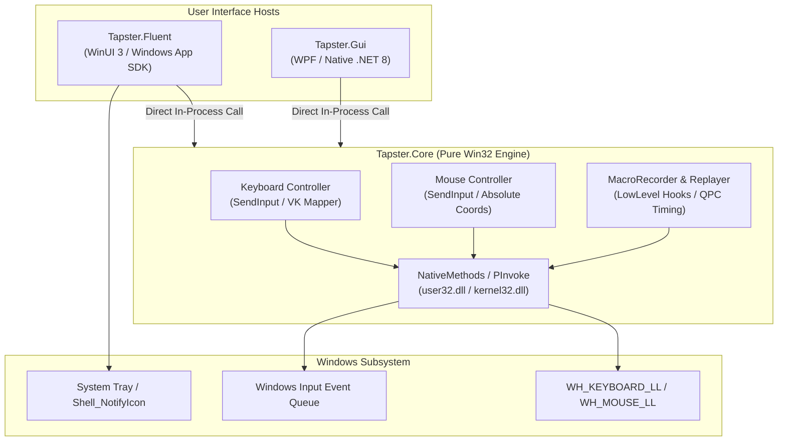

# Tapster Architecture & Engineering Specification

## 1. System Overview

Tapster is a modern, high-performance Windows automation assistant engineered for deterministic keyboard and mouse emulation, macro recording/replay, and continuous action holding. It provides a dual-interface architecture: a lightweight WPF utility interface (`Tapster.Gui`) and an acrylic/mica-styled Windows 11 Fluent application (`Tapster.Fluent`), both powered by a unified unmanaged Win32 driver engine (`Tapster.Core`).



---

## 2. Core Architecture Components

### 2.1 `Tapster.Core` (Engine Layer)
- **Zero-Dependency Win32 Foundation**: Operates directly on `user32.dll` and `kernel32.dll` via P/Invoke.
- **Hardware Simulation via `SendInput`**:
  - Key presses and releases use `INPUT` unions with `INPUT_KEYBOARD` flags.
  - Unicode character synthesis uses `KEYEVENTF_UNICODE` for full CJK and international symbol support.
  - Mouse coordinates are mapped to normalized absolute screen space `[0..65535]` using system metrics (`SM_CXSCREEN`, `SM_CYSCREEN`).
- **High-Precision Macro Recording**:
  - Leverages Low-Level Windows Hooks (`WH_KEYBOARD_LL`, `WH_MOUSE_LL`).
  - Action delta timestamps are calculated using `Stopwatch` (backed by hardware QueryPerformanceCounter) to guarantee sub-millisecond precision.
- **Thread Safety & Cancellation Model**:
  - Worker threads run decoupled from the UI thread using captured non-nullable `CancellationToken` structs.
  - Cancellation signals propagate instantly to break micro-sleep loops without unhandled thread aborts.

### 2.2 `Tapster.Fluent` (Modern Host)
- **Framework**: WinUI 3 (Windows App SDK 2.x+), targeted at Windows 10 build 19041 and Windows 11 build 22000+.
- **Desktop Integration**:
  - Runs in system tray via unmanaged `Shell_NotifyIconW` and hidden message-only Win32 routing windows.
  - Global hotkey listener (`Ctrl + Alt + T`) registered via `RegisterHotKey` for instantaneous wake-up without polling.
  - Responsive Mica backdrop material and dynamic Theme switching (Light / Dark).

### 2.3 `Tapster.Gui` (Lightweight Native WPF Host)
- **Framework**: WPF targeting .NET 8 (Windows Desktop).
- **Purpose**: Minimal memory footprint (~25 MB working set), single-window operational view, instantaneous startup time (<100ms).
- **Virtual Keyboard Grid**: Interactive 5-row visual keyboard layout mapped to virtual key names, providing visual active/held state styling.

---

## 3. Data Flow & Execution Model

### 3.1 Macro Recording Pipeline
```
[User Input Event]
        │
        ▼
[WH_KEYBOARD_LL / WH_MOUSE_LL]  (LowLevel Hook Proc)
        │
        ├─► Extract Virtual Key / Button / Screen Coords (X, Y)
        ├─► Timestamp Calculation: (Now - RecordingStartTime)
        └─► Append RecordedAction to Thread-Safe Collection
```

### 3.2 Macro Replay Pipeline
```
[Recorded Action Queue]
        │
        ▼
[Replay Controller Task]
        │
        ├─► Evaluate Cancellation Token (IsCancellationRequested)
        ├─► Calculate Scaled Delay: (Action[i].Time - Action[i-1].Time) / SpeedMultiplier
        ├─► High-Precision Sleep / SpinWait
        ├─► Synthesize Action via SendInput (Press / Release / Move / Click)
        └─► Dispatch Progress Notification to UI Thread
```

---

## 4. Technical Constraints & Design Decisions

| Architectural Decision | Rationale | Engineering Trade-off |
| :--- | :--- | :--- |
| **`SendInput` vs Driver-level (KMDF)** | Avoids requiring signed kernel drivers or test-signing mode. Runs with standard user elevation. | Cannot inject into UIPI-isolated processes running at higher integrity levels (e.g. Task Manager unless elevated). |
| **Direct P/Invoke without Wrapper DLL** | Eliminates secondary unmanaged DLL deployment and C++ compilation toolchain requirements. | Requires rigorous unmanaged struct memory alignment (`StructLayout`, `FieldOffset`). |
| **CancellationToken Closure Structs** | Eliminates SonarCloud `S2589`/`S2583` redundant null-check warnings and potential `CS8602` dereference bugs. | Requires pre-capturing `_cts?.Token ?? CancellationToken.None` before launching background tasks. |
| **`Path.Join` across all path calculations** | Resolves CodeQL CWE-22 / CWE-73 directory traversal pitfalls and normalizes path separators. | Requires .NET Core 2.1+ / .NET Standard 2.1 baseline (fully met by .NET 8). |
